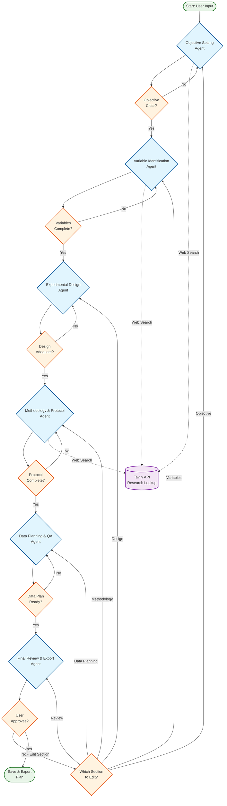

# Sub-PRD 1: Experiment Planning & Design Agent

**Owner:** Developer 1 (The Architect)  
**Epic:** The Experiment Planner  
**Goal:** To create a conversational AI that guides a user from a vague idea to a structured, actionable research plan using a multi-agent architecture.

## 1. Feature Overview

This module provides a conversational interface where a researcher interacts with an AI agent system to build out a complete experiment plan. The system uses a multi-agent architecture with LangGraph, where specialized agents collaborate to ensure the plan is well-defined, methodologically sound, and ready for data collection.

### Multi-Agent Architecture

The system consists of six specialized agents orchestrated through LangGraph:

1. **Initial Inquiry & Objective Setting Agent** - Clarifies research objectives and translates vague ideas into measurable goals
2. **Variable Identification Agent** - Identifies and defines independent, dependent, and control variables
3. **Experimental Design Agent** - Designs experiment structure, groups, controls, and statistical power
4. **Methodology & Protocol Agent** - Generates step-by-step protocols and material lists
5. **Data Planning & QA Agent** - Defines data collection strategies and identifies potential pitfalls
6. **Final Review & Export Agent** - Compiles, reviews, and exports the complete plan

Each agent maintains and updates a shared `ExperimentPlanState` object that contains all experiment details.

### LangGraph Flow Architecture

The following diagram illustrates the agent flow and decision points within the LangGraph system:



This flow demonstrates several key architectural features:
- **Sequential Processing**: Each agent builds upon the previous agent's work
- **Conditional Routing**: Decision points ensure quality before proceeding
- **Loop-back Capability**: Users can refine any section without losing progress
- **Tavily Integration**: Key agents can perform web searches for current research and protocols
- **Flexible Navigation**: The router allows jumping back to any section for edits

## 2. User Stories

### Core Planning Stories
- **As a researcher,** I want to start with a vague experiment idea and have the AI guide me through clarifying questions to develop a clear, measurable objective.
- **As a researcher,** I want the AI to help me identify all relevant variables (independent, dependent, control) and suggest appropriate measurement methods for my specific research domain.
- **As a researcher,** I want the AI to recommend experimental groups, control groups, and statistically appropriate sample sizes based on my objectives.
- **As a researcher,** I want the AI to generate a detailed, step-by-step experimental protocol with specific parameters (concentrations, volumes, temperatures, timing).
- **As a researcher,** I want the AI to automatically compile a comprehensive materials and equipment list based on my protocol.

### Domain-Specific Stories
- **As a biotech researcher,** I want the AI to understand common laboratory techniques and suggest validated protocols for my experimental approach.
- **As a researcher,** I want the AI to identify potential experimental pitfalls and suggest troubleshooting strategies specific to my methodology.
- **As a researcher,** I want the AI to recommend appropriate statistical tests and visualization methods for my experimental design.
- **As a researcher,** I want the AI to perform statistical power calculations to ensure my sample size is adequate for detecting meaningful effects.

### User Experience Stories
- **As a researcher,** I want to easily navigate back to any section of the plan to make modifications without losing my progress.
- **As a researcher,** I want to see a real-time summary of my experiment plan as it's being built.
- **As a researcher,** I want the AI to explain why it's asking specific questions or making particular suggestions.
- **As a researcher,** I want the final plan to be saved and exported as both a structured document and a formatted PDF.

## 3. Functional Requirements

### Core Conversation Management
- A dedicated UI section for "New Experiment Plan" with a chat-like interface
- Real-time state management that builds the experiment plan incrementally
- Ability to loop back to previous sections for refinement without data loss
- Visual progress indicator showing current stage and completed sections
- Real-time plan summary panel that updates as the conversation progresses

### Agent-Specific Functionality

#### Objective Setting Agent
- Natural language processing to extract research intent from vague descriptions
- Guided questioning to develop SMART (Specific, Measurable, Achievable, Relevant, Time-bound) objectives
- Web search integration to verify scientific terminology and current research standards
- Validation of objective feasibility and scope

#### Variable Identification Agent
- Automated suggestion of relevant variables based on research domain
- Web search capabilities to find current measurement techniques and their applications
- Validation of variable relationships and logical consistency
- Support for both quantitative and qualitative variables

#### Experimental Design Agent
- Statistical power calculation tools integrated into the conversation
- Automated suggestion of appropriate control groups (negative, positive, technical)
- Randomization and blinding recommendations where applicable
- Sample size optimization based on statistical requirements and practical constraints

#### Methodology & Protocol Agent
- Web search integration (Tavily) to find current laboratory protocols and best practices
- Automated generation of step-by-step procedures with specific parameters
- Real-time access to scientific literature and protocol repositories
- Safety consideration integration for hazardous procedures

#### Data Planning & QA Agent
- Automated suggestion of appropriate statistical tests based on experimental design
- Data collection format recommendations and templates
- Comprehensive troubleshooting guide generation
- Expected outcomes formulation and success criteria definition

#### Final Review & Export Agent
- Internal consistency checking across all plan components
- Multiple export formats (JSON, PDF, Word document)
- Plan versioning and revision tracking
- Integration with user dashboard for plan management

### Advanced Features
- **Web Search Integration:** Real-time access to scientific literature, protocols, and best practices using Tavily search
- **Template System:** Pre-built templates for common experiment types (PCR optimization, cell viability assays, ELISA validation)
- **Collaborative Features:** Allow multiple researchers to review and comment on plans
- **Learning System:** Improve suggestions based on successful experiment outcomes (anonymized)

## 4. Technical Considerations

### Frontend Architecture
- **React Components:** Build reusable components for chat interface, plan summary, and section navigation
- **State Management:** Use Zustand or React Context for managing live `ExperimentPlanState`
- **Real-time Updates:** WebSocket connection for live plan updates and agent responses
- **Responsive Design:** Mobile-friendly interface for plan review and minor edits

### Backend Architecture (LangGraph)

#### State Definition
```python
class ExperimentPlanState(TypedDict):
    # Core Identification
    experiment_id: str
    research_query: str
    experiment_objective: Optional[str]
    hypothesis: Optional[str]
    
    # Variables
    independent_variables: List[Dict[str, Any]]  # name, type, units, levels
    dependent_variables: List[Dict[str, Any]]    # name, type, units, measurement_method
    control_variables: List[Dict[str, Any]]      # name, reason, control_method
    
    # Experimental Design
    experimental_groups: List[Dict[str, Any]]    # name, description, conditions
    control_groups: List[Dict[str, Any]]         # type, purpose, description
    sample_size: Dict[str, Any]                  # biological_replicates, technical_replicates, power_analysis
    
    # Methodology
    methodology_steps: List[Dict[str, Any]]      # step_number, description, parameters, duration
    materials_equipment: List[Dict[str, Any]]    # name, type, quantity, specifications
    
    # Data & Analysis
    data_collection_plan: Dict[str, Any]         # methods, timing, formats
    data_analysis_plan: Dict[str, Any]           # statistical_tests, visualizations, software
    expected_outcomes: Optional[str]
    potential_pitfalls: List[Dict[str, Any]]     # issue, likelihood, mitigation
    
    # Administrative
    ethical_considerations: Optional[str]
    timeline: Optional[Dict[str, Any]]
    budget_estimate: Optional[Dict[str, Any]]
    
    # System State
    current_stage: str
    completed_stages: List[str]
    user_feedback: Optional[str]
    errors: List[str]
    chat_history: List[Dict[str, Any]]
    created_at: datetime
    updated_at: datetime
```

#### LangGraph Node Structure
```python
# Example node definitions
def objective_clarifier_node(state: ExperimentPlanState) -> ExperimentPlanState:
    """Clarifies research objectives and develops measurable goals"""
    # Implementation details...

def variable_identifier_node(state: ExperimentPlanState) -> ExperimentPlanState:
    """Identifies and defines experimental variables"""
    # Implementation details...

def experimental_designer_node(state: ExperimentPlanState) -> ExperimentPlanState:
    """Designs experiment structure and statistical parameters"""
    # Implementation details...

# Graph construction
graph = StateGraph(ExperimentPlanState)
graph.add_node("objective_clarifier", objective_clarifier_node)
graph.add_node("variable_identifier", variable_identifier_node)
graph.add_node("experimental_designer", experimental_designer_node)
# ... additional nodes

# Define edges with conditional routing
graph.add_conditional_edges(
    "objective_clarifier",
    lambda state: "variable_identifier" if state.experiment_objective else "objective_clarifier"
)
```

### Integration Requirements
- **Web Search API:** Tavily integration for real-time scientific literature and protocol search
- **Statistical Libraries:** Integration with scipy.stats, statsmodels for power calculations
- **Document Generation:** PDF/Word generation capabilities for plan export
- **Database:** Firestore for plan persistence and user management

### API Contract
The system must produce a comprehensive `ExperimentPlan.json` that includes all state components and is compatible with downstream modules (Data Steward, Analysis Co-pilot).

## 5. Acceptance Criteria

### Core Functionality
- [ ] A user can successfully navigate the entire conversation flow from vague idea to complete experiment plan
- [ ] The system generates a comprehensive `ExperimentPlan.json` with all required components
- [ ] The conversation feels natural and guides users effectively without getting stuck in loops
- [ ] Users can navigate back to any section to make modifications without data loss
- [ ] The generated plan is saved correctly to the user's account in Firestore

### Domain Expertise
- [ ] The system demonstrates biotech domain knowledge in variable suggestions and protocol generation
- [ ] Statistical power calculations are performed accurately and integrated naturally into the conversation
- [ ] The system identifies relevant potential pitfalls and provides actionable troubleshooting suggestions
- [ ] Generated protocols include specific, actionable parameters (concentrations, volumes, temperatures, timing)

### User Experience
- [ ] The interface provides clear visual feedback about conversation progress and plan completeness
- [ ] Users can export plans in multiple formats (JSON, PDF, formatted document)
- [ ] The system explains its reasoning for suggestions and requirements
- [ ] Response times are under 3 seconds for standard agent interactions
- [ ] The system gracefully handles edge cases and user errors with helpful guidance

### Technical Performance
- [ ] The LangGraph state management maintains consistency across all agent interactions
- [ ] The system handles concurrent users without state conflicts
- [ ] All generated plans pass internal consistency validation
- [ ] The system integrates successfully with Tavily for web-based research and protocol suggestions
- [ ] API responses conform to the established contract for downstream module integration